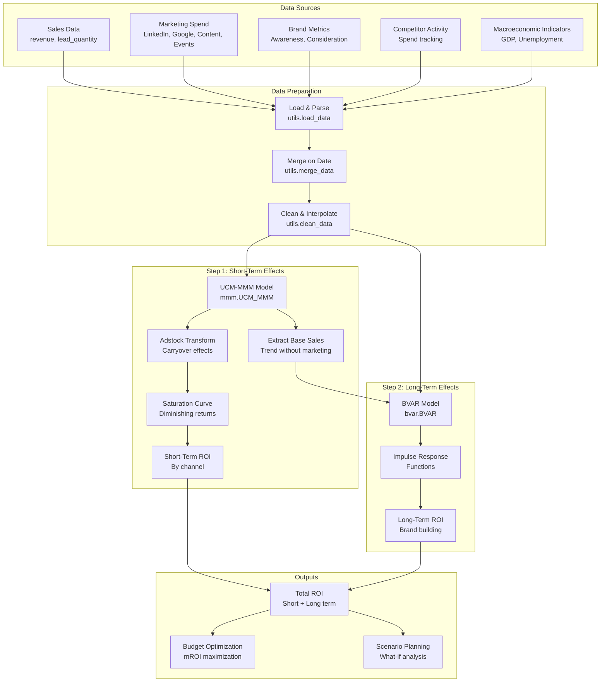
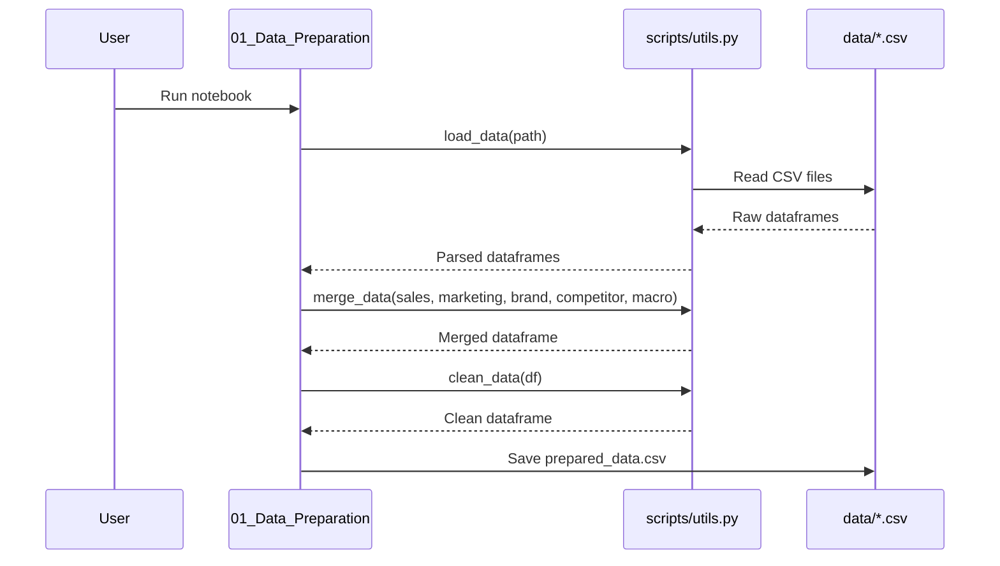
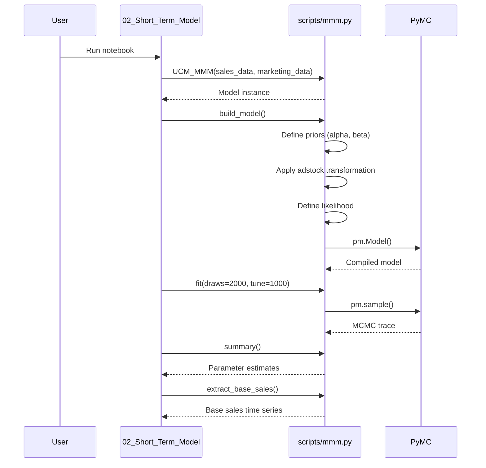
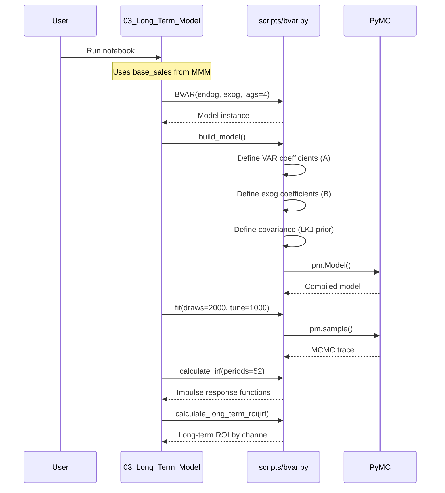
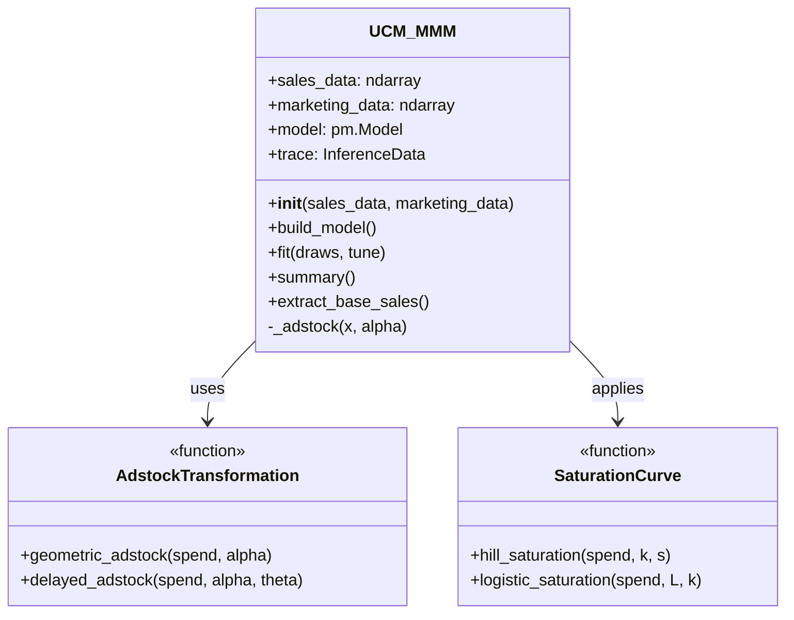
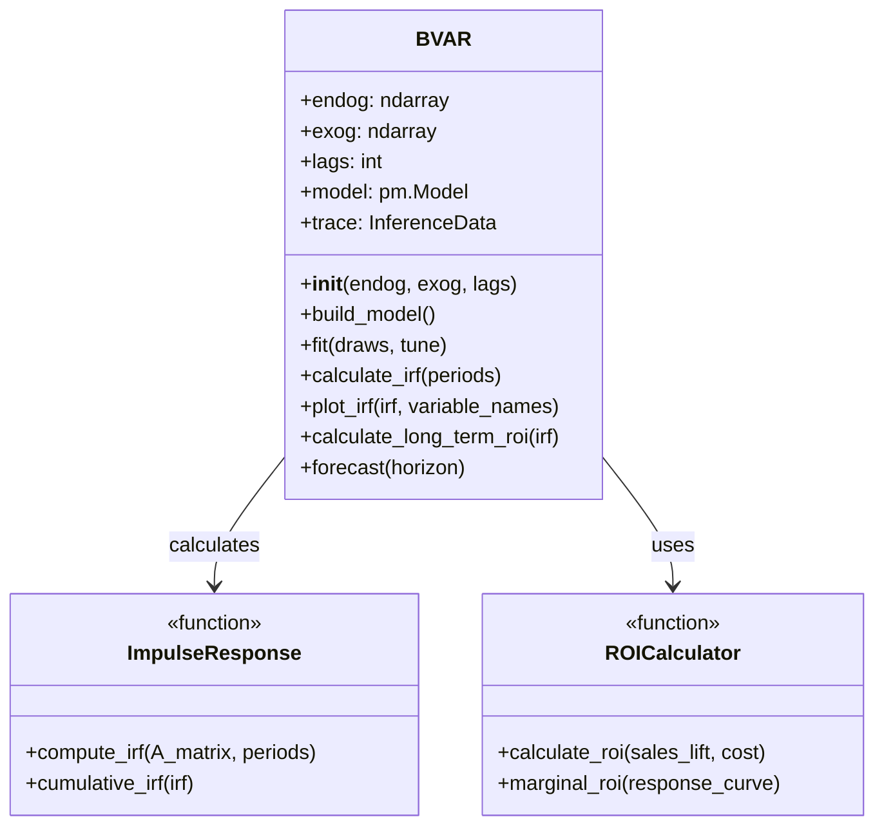
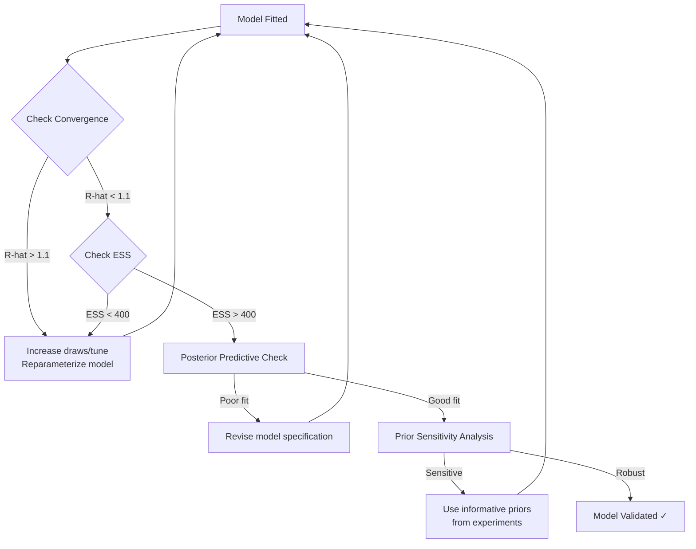
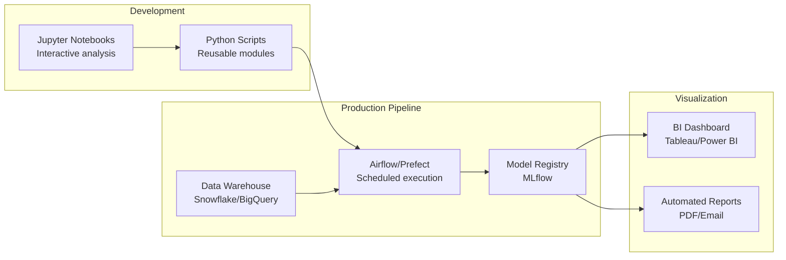

# Architecture Documentation

## System Overview

This framework implements a two-step Bayesian approach to Marketing Mix Modeling that separates short-term activation effects from long-term brand-building effects.



## Data Flow Pipeline

### Phase 1: Data Preparation



### Phase 2: Short-Term Model (UCM-MMM)



### Phase 3: Long-Term Model (BVAR)



## Component Architecture

### UCM-MMM Model Components



### BVAR Model Components



## Model Mathematics

### UCM-MMM Equation

The UCM-MMM decomposes sales into components:

```
Sales[t] = Baseline[t] + Marketing_Effect[t] + Seasonality[t] + Error[t]

Marketing_Effect[t] = Σ(β_i × Saturation(Adstock(Spend_i[t])))

where:
  - Adstock[t] = Spend[t] + α × Adstock[t-1]  (geometric decay)
  - Saturation(x) = k × x^s / (λ^s + x^s)      (Hill function)
```

### BVAR Equation

The BVAR models dynamic relationships:

```
Y[t] = A₁×Y[t-1] + A₂×Y[t-2] + ... + Aₚ×Y[t-p] + B×X[t] + ε[t]

where:
  Y[t] = [BaseSales[t], Awareness[t], Consideration[t]]ᵀ
  X[t] = [Spend_LinkedIn[t], Spend_Google[t], ...]ᵀ
  ε[t] ~ MVN(0, Σ)
```

### Impulse Response Function

IRF traces the effect of a shock over time:

```
IRF(h) = ∂Y[t+h] / ∂ε[t]

Long-term effect = Σ(IRF(h)) for h = 0 to ∞
```

## Technology Stack

| Component | Technology | Purpose |
|-----------|-----------|---------|
| **Core Language** | Python 3.13+ | Primary programming language |
| **Statistical Modeling** | PyMC | Bayesian inference and MCMC sampling |
| **Marketing Models** | PyMC-Marketing | Pre-built MMM components |
| **Data Processing** | pandas, numpy | Data manipulation and numerical computation |
| **Visualization** | matplotlib, seaborn, plotly | Charts and interactive plots |
| **Analysis Environment** | JupyterLab | Interactive notebooks |

## Model Validation Workflow



## Deployment Architecture



## File Structure

```
long-term-ad-effectiveness/
├── data/                          # Raw and prepared datasets
│   ├── sales.csv                  # Revenue and customer metrics
│   ├── marketing_spend.csv        # Channel spend by week
│   ├── brand_metrics.csv          # Awareness, consideration
│   ├── competitor_activity.csv    # Competitor spend
│   ├── macroeconomic_indicators.csv
│   └── prepared_data.csv          # Merged and cleaned
│
├── scripts/                       # Core modeling modules
│   ├── mmm.py                    # UCM-MMM implementation
│   ├── bvar.py                   # BVAR implementation
│   ├── utils.py                  # Data utilities
│   └── generate_synthetic_data.py
│
├── notebooks/                     # Analysis workflow
│   ├── 01_Data_Preparation.ipynb
│   ├── 02_Short_Term_Model.ipynb
│   ├── 03_Long_Term_Model.ipynb
│   ├── 04_Model_Validation.ipynb
│   └── 05_Insight_Generation.ipynb
│
├── docs/                         # Documentation
│   ├── ARCHITECTURE.md           # This file
│   ├── API_REFERENCE.md          # API documentation
│   └── USER_GUIDE.md             # Usage examples
│
└── reports/                      # Generated outputs
    └── (figures, tables, PDFs)
```

## Scalability Considerations

### Data Volume
- **Current**: Weekly granularity, 2-4 years (100-200 weeks)
- **Scalable to**: Daily granularity, 5+ years (1800+ days)
- **Bottleneck**: MCMC sampling time increases with observations

### Model Complexity
- **Current**: 3-4 marketing channels, 2-3 brand metrics
- **Scalable to**: 10+ channels with hierarchical models
- **Approach**: Use partial pooling for similar channels

### Computational Performance
- **MCMC Sampling**: Enable `cores > 1` for parallel chains
- **Large datasets**: Use mini-batch sampling or variational inference (ADVI)
- **Cloud deployment**: Use GPU-accelerated sampling on cloud VMs

## Security & Privacy

- **Data Handling**: All data stays within the organization's infrastructure
- **No external APIs**: Models run entirely offline
- **PII Protection**: No personally identifiable information in datasets
- **Access Control**: Use git repository permissions for code access
